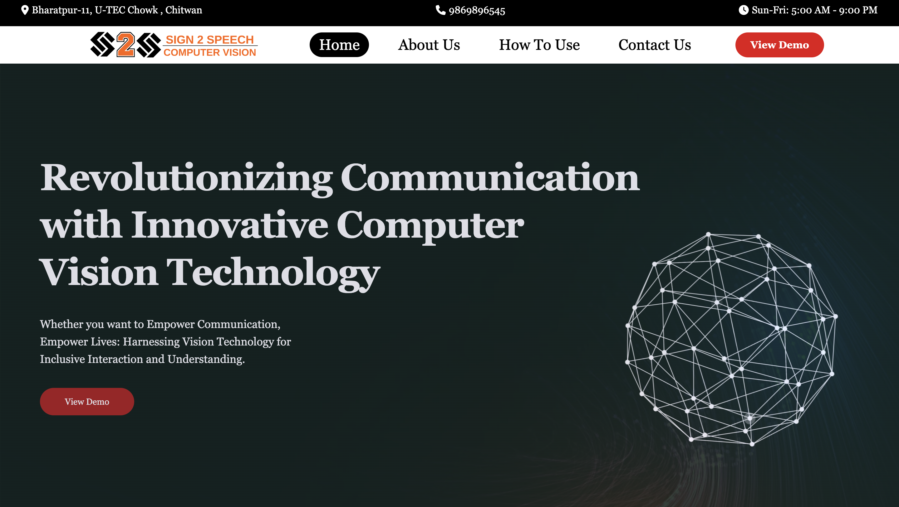

# Sign2Speech - BIC V.3.0 Hackathon Project



# Overview

Sign2Speech is a project developed by students from United Technical College as part of the BIC V.3.0 Hackathon. The project aims to leverage computer vision and deep learning technologies, using libraries such as Mediapipe, OpenCV, and Scikit Learn, to create a sign language detection system. This system provides real-time audio and visual outputs in the form of text and speech, making communication more inclusive for individuals with hearing impairments.

## Key Features

1. **Communication Inclusivity:**
   - Facilitates effective communication for individuals with hearing impairments.
2. **Accessibility in Digital Spaces:**
   - Integrates sign language detection into digital platforms for inclusivity.
3. **Education and Learning:**
   - Enhances inclusivity in educational settings for deaf or hard-of-hearing students.
4. **Employment Opportunities:**
   - Creates a more inclusive work environment for individuals who use sign language.
5. **Healthcare Communication:**
   - Facilitates communication between healthcare providers and patients with hearing impairments.
6. **Emergency Situations:**
   - Enables real-time communication during emergency situations.
7. **Social Inclusion:**
   - Breaks down communication barriers for participation in social interactions.
8. **Advancement in Human-Computer Interaction:**
   - Contributes to advancements in intuitive and accessible interfaces.
9. **Legal and Civic Participation:**
   - Enhances participation in legal and civic processes for individuals with hearing impairments.

## Getting Started

1. **Clone the Repository:**

   ```bash
   git clone https://github.com/your-username/sign2speech.git
   cd sign2speech
   ```

2. **Install Dependencies:**

   ```bash
   pip install -r requirements.txt
   ```

3. **Run the Application:**
   ```bash
   python main.py
   ```

## Contributing

We welcome contributions and feedback. If you'd like to contribute to Sign2Speech, please follow our [Contribution Guidelines](CONTRIBUTING.md).

## License

This project is licensed under the [MIT License](LICENSE).

## Acknowledgments

We would like to express our gratitude to [United Technical College] for supporting us in this hackathon.

Note: This README is subject to change as the project progresses. Check back for updates!
